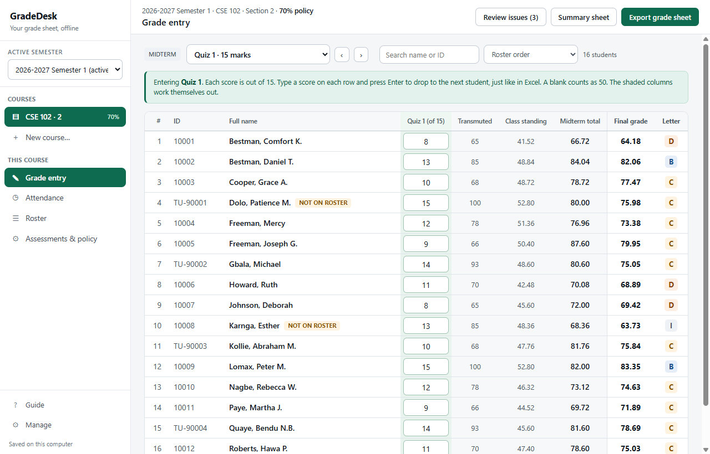
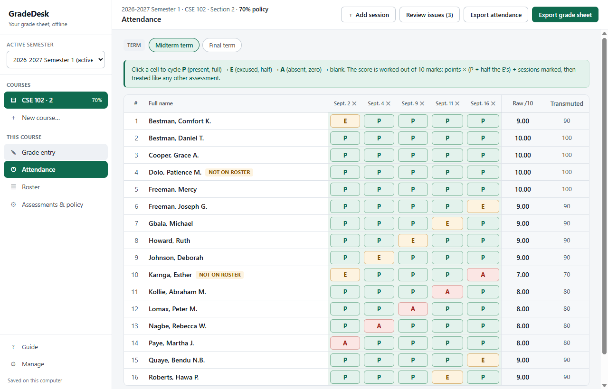
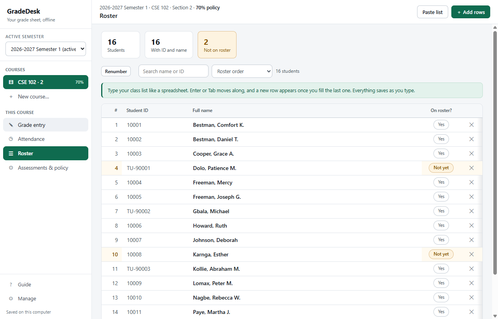
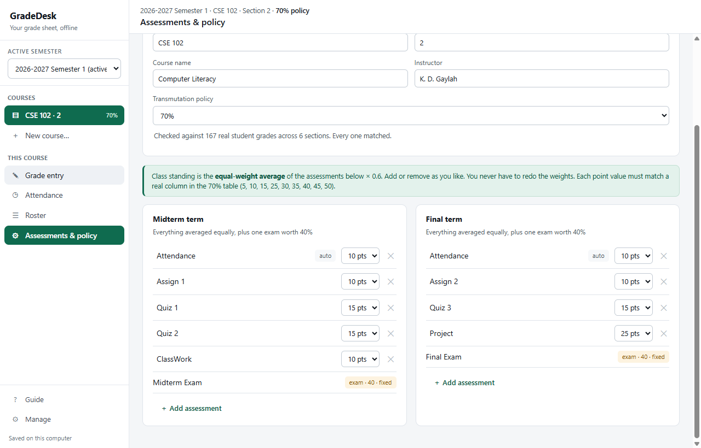
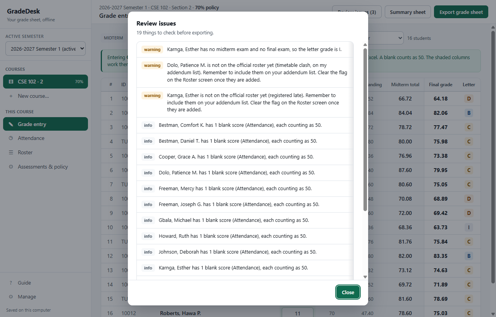
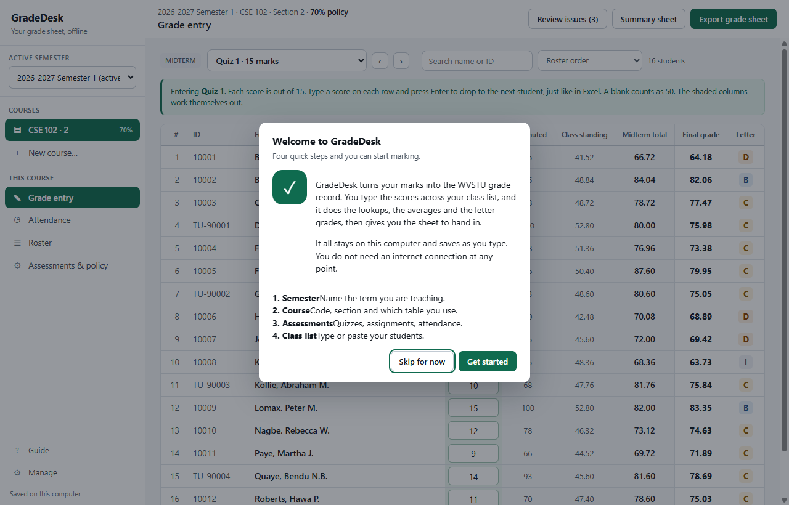
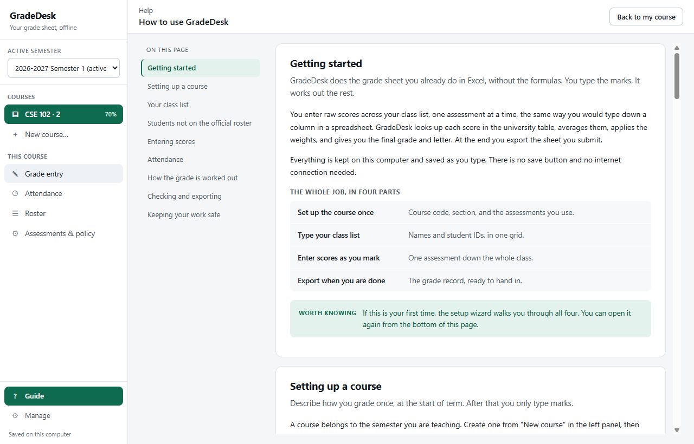

<div align="center">


# GradeDesk

**The grade sheet you already do in Excel, without the formulas.**

An offline Windows app that turns raw assessment scores into a WVSTU grade
record. You type the marks. It handles the transmutation, the averaging, the
weighting and the letter grades, then exports the sheet you submit.

</div>

---

## Table of Contents

- [Overview](#overview)
- [📸 Screenshots](#-screenshots)
- [Features](#features)
- [Install on another PC](#install-on-another-pc)
- [Which file do I run?](#which-file-do-i-run)
- [Using it](#using-it)
- [How the grade is worked out](#how-the-grade-is-worked-out)
- [Your data and your backups](#your-data-and-your-backups)
- [The correctness bar](#the-correctness-bar)
- [Building it yourself](#building-it-yourself)
- [Project structure](#project-structure)
- [Testing](#testing)
- [Troubleshooting](#troubleshooting)
- [Scope](#scope)
- [Developer](#developer)

---

## Overview

Every semester, instructors at William V.S. Tubman University turn raw student
marks into the required grade record by hand in Excel. Each score has to be
looked up in a university transmutation table, averaged into a class-standing
figure, combined with an exam score, and merged across two terms. Across dozens
of students and a dozen assessments, it is slow and easy to get wrong.

GradeDesk does the same job the same way, but you only type the marks. It runs
entirely on your own computer, needs no internet connection at any point, and
saves as you type.

It is built for real conditions: unreliable power, poor connectivity, and
ordinary low-spec Windows laptops.

---

## 📸 Screenshots

### Grade entry

The screen you spend your time in. Pick one assessment, type scores straight
down the column, press Enter to drop to the next student. The shaded columns
work themselves out as you go.



### Attendance

Add a session for each class you hold, then click a cell to cycle it: present,
excused, absent, or blank. The score works itself out and feeds the grade like
any other assessment.



### Your class list

Type it once or paste it in. Students who are sitting your class but are not on
the official roster yet can be flagged, so you remember to put them on your
addendum list.



### Assessments and policy

Describe how you grade once at the start of term. Add or remove assessments
freely; you never have to redo weights.



### Check before you export

Catches the things a spreadsheet will not tell you about: a score above its
maximum, a missing exam that forces an I, blank scores counting as 50, and
students still waiting on your addendum list.



### Setup wizard and guide

A four-step wizard on first run, and a full guide you can open at any time.





---

## Features

- ✅ **Type across the class, not per student.** One assessment at a time, down
  the column, exactly like a spreadsheet. Enter and Tab advance.
- ✅ **The maths is done for you.** Transmutation, class standing, term totals,
  final grade and letter, all live as you type.
- ✅ **Attendance scores itself.** Mark P, E or A per session; the score is
  worked out and treated like any other assessment.
- ✅ **Search and sort.** Find one student while you fix a score, or order the
  list by name, ID, score, grade or blanks first.
- ✅ **Flag students not on the roster.** For anyone sitting in after a
  timetable clash or a late registration, until your addendum list goes in.
- ✅ **Three exports.** Full grade record, summary sheet, and attendance. All
  in the familiar layout, ready to submit without reformatting.
- ✅ **Nothing to save.** Every score is written to disk the moment you leave
  the cell. A power cut costs you nothing already entered.
- ✅ **Completely offline.** No accounts, no internet, no data leaves your
  machine.

---

## Install on another PC

You need one file: **`GradeDesk-Setup-1.0.0.exe`**.

1. **Copy the installer** onto a flash drive, or download it from the
   [Releases page](https://github.com/KwiteeGaylah/GradeDesk/releases).
2. **Double-click it** on the other PC.
3. Windows may show a blue **"Windows protected your PC"** screen. This appears
   because the installer is not code-signed, not because anything is wrong.
   Click **More info**, then **Run anyway**.
4. Choose where to install it, or accept the default.
5. GradeDesk opens, and puts a shortcut on the desktop and in the Start menu.

That is the whole process. No internet connection is needed, and nothing else
has to be installed first.

**Requirements:** Windows 10 or 11, 64-bit. About 400 MB of disk space.

### Moving your existing work to the new PC

The installer gives you an empty GradeDesk. To carry your courses and grades
across:

1. On the **old** PC: **Manage → Save a backup**. Put the file on a flash drive.
2. Install GradeDesk on the **new** PC as above.
3. On the **new** PC: **Manage → Load a backup**, and pick that file.

Everything comes across: semesters, courses, class lists, scores and attendance.

> ⚠️ Loading a backup replaces whatever is currently in GradeDesk on that
> machine. You are asked to confirm first.

---

## Which file do I run?

After a build there are two `.exe` files, which is confusing. Here is the
difference:

| File | Size | What it is | Use it? |
|---|---|---|---|
| `dist/GradeDesk-Setup-1.0.0.exe` | ~119 MB | **The installer.** One self-contained file. Installs the app properly, with shortcuts and an uninstaller. | ✅ **This is the one to share.** |
| `dist/win-unpacked/GradeDesk.exe` | ~235 MB | The unpacked app. It only runs from inside the `win-unpacked` folder, alongside the 17 other files it needs. | ❌ Build output. Copying it alone will not work. |

If you are giving GradeDesk to another instructor, send them the **Setup** file.

---

## Using it

### First time

The setup wizard runs on its own and walks you through four steps: name your
semester, create a course, pick your assessments, and paste or type your class
list. You can skip it and do the same things from the left panel.

### Every day

1. **Grade entry.** Pick an assessment from the dropdown at the top. Type each
   score down the column.
2. **Attendance.** Add a session per class meeting, then click along each row.
3. **Review issues.** Before exporting, check the list.
4. **Export.** The grade sheet, the summary, or attendance.

### Keys worth knowing

| Key | What it does |
|---|---|
| `Enter` | Save and drop to the next student |
| `Tab` / `Shift+Tab` | Move down or back up the column |
| `↑` `↓` | Move without changing anything |
| `Esc` | Leave the box you are in |
| `‹` `›` | Previous or next assessment |

The full guide is always available from the **Guide** button at the bottom of
the left panel.

---

## How the grade is worked out

Each term is scored out of 100, then the two are combined.

```
transmuted     = look the raw score up in the university table (snap-down)
class standing = average of the transmuted scores  × 0.60
term total     = class standing + transmuted exam  × 0.40
final grade    = midterm total × 0.40 + final total × 0.60
```

Letters are **A** from 90, **B** from 80, **C** from 70, **D** from 60,
otherwise **F**. A blank midterm or final exam makes the letter **I** whatever
the numbers say. **NG** means the grade could not be worked out at all.

Five things worth keeping straight, because they are where this usually goes
wrong:

- **The lookup snaps down, never exact.** A score that falls between two listed
  values takes the lower one, exactly as `VLOOKUP(..., TRUE)` does.
- **A blank assessment counts as 50** and stays in the average. A blank *exam*
  is a different rule: it forces the letter I.
- **Point values do not have to add up to anything.** Each score becomes a value
  between 50 and 100 first, and those are what get averaged. Three assessments
  at full marks give exactly 60, and so do five.
- **The final grade is truncated to two decimals, never rounded up.** An 89.99
  stays a B.
- **The exam is always out of 40**, and is not configurable.

Attendance is worked out as `points × (P + half the E's) ÷ sessions marked`,
then rounded to a whole point. Dividing by sessions actually marked, rather than
the whole term, keeps it fair before the term has finished.

---

## Your data and your backups

Everything lives in one file on your own computer:

```
%APPDATA%\GradeDesk\gradedesk.db
```

Scores are written to disk the moment you leave the cell, with no save button
and nothing to remember. Automated tests kill the app outright immediately
after a score is typed and confirm the score survives and the database still
passes an integrity check.

**Back up at the end of every marking session.** Manage → Save a backup writes
everything to a single file you can copy to a flash drive.

> 🔒 Nothing is ever sent anywhere. There is no network code in the app at all.

---

## The correctness bar

The grading model is not an approximation of the spreadsheet. It reproduces it
exactly, and a standing automated test proves it on every run.

| Check | Result |
|---|---|
| Students verified | 167 across 6 sections |
| Final grades matching | 167 / 167 |
| Letter grades matching | 167 / 167 |
| Class standings and term totals | all matching |
| Mismatches | **0** |

The same 167 students are also driven through the whole application, stored in
the database, computed by the same code the screens use, exported to `.xlsx`
and restored from a backup, and still come out identical.

If that test ever fails, the engine is wrong, not the test.

> 📁 **The verification workbook is not in this repository.** It holds real
> students with their names and ID numbers. It stays on the instructor's own
> machine at `data/`, and is gitignored. Every name and ID you see in the
> screenshots, the tests and the sample data is invented.

### Transmutation tables

`data/transmutation_tables.json` holds all three university policies and is
loaded as data; nothing is hard-coded.

| Policy | Standing |
|---|---|
| **70%** | Grade-verified against a real completed grade sheet. The default. |
| 60% | Copied from the university tables, structurally checked. |
| 50% | Copied from the university tables, structurally checked. |

Structural checking means every column starts at 50, reaches 100 at its maximum,
lists every raw score, and never dips. Those checks run over all three policies
in the test suite, and they are what caught an earlier mis-transcription.

---

## Building it yourself

**Requirements:** Node.js 20 or newer, and Windows for the installer target.

```bash
git clone https://github.com/KwiteeGaylah/GradeDesk.git
cd GradeDesk
npm install

npm start              # run the app
npm test               # the full suite
npm run dist           # build the installer into dist/
```

The installer lands at `dist/GradeDesk-Setup-1.0.0.exe`.

To run the 167-student verification test you need the instructor's own workbook
at `data/`, since it is deliberately not in the repository. Every other test
runs without it.

Other useful scripts:

```bash
npm run smoke          # boot the real app, fail on any renderer error
npm run uitest         # drive a full workflow and cross-check on-screen grades
npm run screenshot     # write a PNG of the seeded UI
npm run icon           # rasterise build/icon.svg to the installer PNG sizes
npm run check:refs     # catch a module name used but never imported
```

---

## Project structure

```
src/engine/       pure calculation, no UI and no I/O
  transmutation.js    snap-down lookup, the one place matching lives
  grades.js           class standing, term totals, final grade, letters
  policy.js           which policies may be offered, point validation
  roster.js           pasted class-list parsing
  dates.js            date formatting, shared with the renderer
src/data/         SQLite storage and the bridge to the engine
  schema.sql          the data model
  store.js            CRUD; every write commits immediately
  gradebook.js        joins stored data to the engine; issue review
  backup.js           whole-database export and restore
src/export/       Excel output in the WVSTU layout
src/renderer/     the UI: left panel, grade entry, attendance, roster, config
src/main.js       Electron main process, owns the database and all IPC
```

The engine has no dependencies of its own and never touches the UI or the
filesystem. That is what lets the verification test run the exact code the
application runs, and a test asserts the separation stays true.

**Built with** Electron, better-sqlite3 and ExcelJS. Electron because it ships a
self-contained Windows installer that runs offline with no runtime
prerequisites. SQLite because a single transactional file survives a power cut
mid-write, which browser storage does not.

---

## Testing

```bash
npm test
```

**140 tests**, covering:

| Area | What it checks |
|---|---|
| Grade engine | Every rule in the model, including the traps |
| Verification | 167 real students reproduce exactly |
| Round trip | Workbook → database → export → back again |
| Data safety | Kills the process mid-write and checks nothing is lost |
| Export | Real `.xlsx` files written, reopened and read back |
| Colour contrast | Every text pair clears WCAG AA, read from the stylesheet |
| Dates, roster parsing, policies, module wiring | |

Plus **42 live UI checks** (`npm run uitest`) that drive the real application
with real keyboard and mouse input and compare what is on screen against the
engine.

---

## Troubleshooting

**"Windows protected your PC" when installing.**
The installer is not code-signed. Click **More info**, then **Run anyway**.

**The app opens but there are no courses.**
That is a fresh install. The setup wizard should open on its own; if it does
not, click **New course** in the left panel.

**Some columns are missing on a small screen.**
Below a certain width the class-standing and term-total columns are hidden so
the final grade and letter stay visible. A note under the table says so. Widen
the window to get them back.

**An export does nothing.**
Check that the save dialog has not opened behind the main window.

**I want to start over.**
Delete `%APPDATA%\GradeDesk\gradedesk.db`. Take a backup first if there is
anything in it you want.

---

## Scope

v1 does one thing well. There is no Excel import, no per-student screen, no
statistics dashboard, no cloud and no multi-user access. Archived semesters stay
readable and exportable.

---

## Developer

Built by **Kwitee D. Gaylah**, an instructor at William V.S. Tubman University,
for the grading workflow he and his colleagues use every semester.

---

<div align="center">

Made for instructors who would rather be teaching than fighting with
spreadsheet formulas ❤️

</div>
